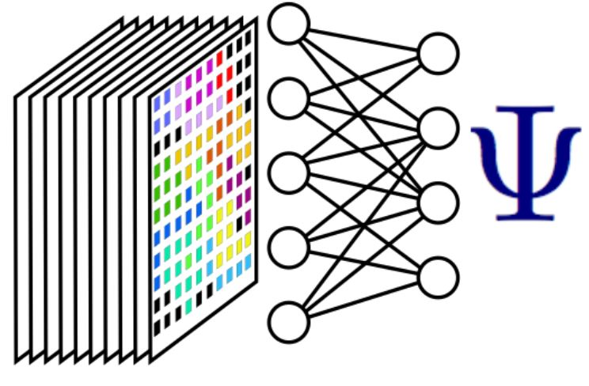
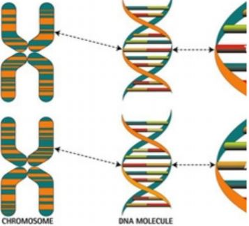

Page still under Construction - adding project descriptions (Sorry for inconvinience): 

Few relevant & interesting projects:

## Accelerated Materials Discovery
  * Machine learning quantum physics to search large chemical space (**O(1041)**) to find favorable materials for photonics and quantum computing applications
  * Density Functional Theory (DFT) based exploration and training. {:height="100px" width="100px"}

## Investigation of generalization in deep neural networks
  * Exploration of how and when we have learning and when we have simple memorization of the training data
  * **Bayesian Evidence** as a tool to explain the observations and to predict if we will observe good generalization.

## Genetic variants classification 
  * Exploration of various machine learning strategies to find the best model which performs best in predicting how likely a genetic variant is have conflicting clinical classifications. {:height="100px" width="100px"}

## DSP application in Genomics & Proteomics
## Shearlets & Curvelets for solving PDEs
## Video Reconstruction using Compressive Sensing
## Anisotropic diffusion based image compression
## Query Handling Systems
## Implementation of OFDM
## Portable Planeterium
